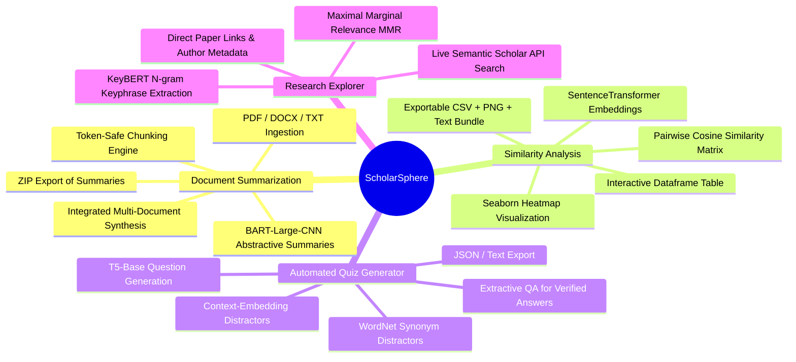

# 01. Project Overview & Features

---

## 1. Introduction & Motivation

Modern academic research and study require navigating massive volumes of text—spanning peer-reviewed papers, textbook chapters, technical documentation, and essay drafts. Researchers and students often face information overload, making it difficult to:
1. Quickly digest key findings across multiple long-form papers.
2. Quantitatively detect conceptual overlaps, redundant citations, or thematic similarity between manuscripts.
3. Formulate testing and self-assessment materials (such as quizzes and multiple-choice questions) directly from source literature.
4. Discover pertinent, state-of-the-art related academic literature based on extracted domain concepts.

**ScholarSphere** was developed to bridge this gap by uniting modern Natural Language Processing (NLP), Deep Learning transformer models, and real-time scholarly search APIs into a single, intuitive, web-based academic companion.

---

## 2. Core Target Audience & Use Cases

| User Group | Primary Use Case | Value Delivered |
| :--- | :--- | :--- |
| **Academic Researchers** | Literature review, multi-paper synthesis, and cross-manuscript similarity checks. | Rapidly synthesizes multiple PDF papers, pinpoints topical alignment across citations, and searches relevant Semantic Scholar literature. |
| **University Students** | Study guide creation, exam revision, textbook comprehension. | Transforms dense chapters into structured bullet summaries and automatically generates interactive MCQs for self-testing. |
| **Educators & Professors** | Assessment formulation and quiz generation. | Automatically constructs question banks, distractors (incorrect answer options), and answer keys directly from lecture notes or syllabus documents. |
| **Technical Writers & Peer Reviewers** | Plagiarism/overlap checking, thesis evaluation, and thematic coherence analysis. | Generates quantitative document-to-document similarity heatmaps and exportable matrix reports. |

---

## 3. Comprehensive Feature Breakdown

ScholarSphere is organized into four main functional pillars, accessible through a responsive multi-tab interface:

---

### Feature 1: Multi-Format Document Summarization

The **Summarization Engine** processes single or multiple documents concurrently, extracting key points and distilling complex narratives into coherent executive summaries without losing critical contextual details.

#### Key Capabilities:
* **Heterogeneous Document Ingestion:** Supports `.pdf` (via `PyPDF2`), `.docx` (via `python-docx`), and raw `.txt` files.
* **Token-Budget Chunking:** Long documents exceeding transformer token limits (1024 tokens) are automatically split along sentence and paragraph boundaries into conservative, overlap-aware chunks (max 900 tokens per sub-chunk).
* **Abstractive BART Engine:** Powered by `facebook/bart-large-cnn`, a sequence-to-sequence model fine-tuned on news and long-form articles to generate grammatically fluent, novel summary phrasing.
* **Dynamic Parameter Customization:** Users can fine-tune `max_length` (100–300 tokens) and `min_length` (50–100 tokens) via sidebar sliders.
* **Integrated Multi-Document Synthesis:** In addition to per-document summaries, ScholarSphere stitches full document texts together and performs an aggregate pass, producing a unified cross-document synthesis.
* **Batch Exporting:** Packages all individual summaries and the integrated analysis into a structured `scholarsphere_summaries.zip` archive.

---

### Feature 2: Document Similarity Analysis

The **Similarity Analysis Engine** quantifies how closely related different documents are in semantic vector space, helping users spot thematic redundancy, citation convergence, or divergence.

#### Key Capabilities:
* **Dense Semantic Embeddings:** Transforms document summaries into 384-dimensional dense vectors using `sentence-transformers/all-MiniLM-L6-v2`.
* **Cosine Similarity Calculation:** Computes pairwise cosine angles between all document embeddings, producing a normalized matrix where scores range from `0.0` (completely dissimilar) to `1.0` (semantically identical).
* **Multi-Tab Visualization Dashboard:**
  1. **Matrix Tab:** Interactive, container-width Pandas DataFrame styled with a Yellow-Orange-Red gradient (`YlOrRd`) and 2-decimal point precision.
  2. **Visualization Tab:** Publication-quality Seaborn heatmap rendered via Matplotlib with 300 DPI resolution, rotated tick labels, and automatic label truncation for readability.
  3. **Summary Tab:** Expandable accordion views displaying the exact text summary used for each vector calculation.
* **Comprehensive Report Export:** Generates an all-in-one ZIP archive (`similarity_analysis_report.zip`) containing:
  - `similarity_matrix.csv` (raw tabular data for Excel/R/Python analysis)
  - `similarity_heatmap.png` (high-res publication figure)
  - `summaries/` directory containing all document summary text files
  - `README.txt` documenting the report contents.

---

### Feature 3: Automated Quiz Generator & Assessment Engine

The **Quizzer Engine** turns raw academic text into rigorous multiple-choice assessments (MCQs), complete with verified answer keys and plausible distractor options.

#### Key Capabilities:
* **T5 Question Formulation:** Employs `mrm8488/t5-base-finetuned-question-generation-ap` (a fine-tuned Text-to-Text Transfer Transformer) to parse text passages and synthesize contextually relevant, grammatically correct inquiry sentences ending with question marks.
* **Ground-Truth QA Verification:** Passes the generated question and source context into an extractive Question-Answering pipeline (`distilbert-base-cased-distilled-squad`) to pinpoint the precise factual answer substring in the text.
* **Hybrid 3-Tier Distractor Generation:** Generates 3 intelligent distractors (incorrect options) for every question:
  1. **Lexical Synonyms:** Extracts related words from Princeton's **NLTK WordNet** synsets and lemmas.
  2. **Semantic Context Filtering:** Encodes neighboring context sentences into vector space and selects sentences with *medium similarity* ($0.3 < \text{sim} < 0.6$) to provide challenging, plausible false choices.
  3. **Randomized Fallback:** Ensures 4 distinct options are always present by sampling background sentences.
* **Interactive UI & Self-Grading:** Displays questions in interactive Streamlit radio-button cards.
* **Dual-Format Export:**
  - **JSON:** Clean schema with `question`, `options` array, and `answer` fields (compatible with LMS platforms like Canvas, Moodle, or Google Forms).
  - **Plain Text:** Formatted question bank with question text, bulleted choices, and answer key.

---

### Feature 4: Research Explorer & Literature Discovery

The **Research Explorer Engine** automates the early stages of literature reviews by uncovering central themes and querying global academic repositories.

#### Key Capabilities:
* **Keyphrase Extraction via KeyBERT:** Uses BERT embeddings with **Maximal Marginal Relevance (MMR)** and a diversity factor of `0.7` to identify 2-to-3-word keyphrases ($N\text{-grams}$) that define the core topics of the document.
* **Direct Integration with Semantic Scholar Graph API:** Automatically submits extracted topic phrases to the public `https://api.semanticscholar.org/graph/v1/paper/search` endpoint.
* **Rich Bibliographic Card Display:** For each topic, renders up to 3 top-ranking peer-reviewed papers, complete with:
  - Paper title with direct hyperlink to open-access / publisher landing page
  - Publication year
  - Primary authors list (up to 3 authors)
* **Silent Network Fault Tolerance:** Implements graceful HTTP timeout and error handling, ensuring network hiccups or rate limits from external APIs do not interrupt local app execution.

---

## 4. Performance & Usability Innovations

### Two-Tier High-Performance Caching
* **RAM Cache:** Streamlit's `@st.cache_resource` loads large transformer weights into memory once, preventing expensive model reloads across browser sessions or page interactions.
* **Disk-Based MD5 Cache:** Computes an MD5 checksum of raw document bytes (`file_hash`). Summaries and 384-d vector embeddings are serialized to `cache_embeddings/<hash>_summary.pkl` and `cache_embeddings/<hash>_embedding.pkl`. Re-uploading previously analyzed documents produces instant results with zero computational overhead.

### Hardware Acceleration Routing (GPU / CPU)
* Includes a dynamic **"Use GPU if available"** toggle in the UI.
* Detects `torch.cuda.is_available()` and automatically maps transformer device IDs (`device=0` for CUDA GPU vs `device=-1` for CPU), allowing seamless execution on low-power laptops and high-performance server clusters alike.
