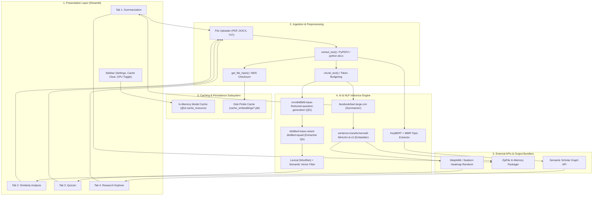
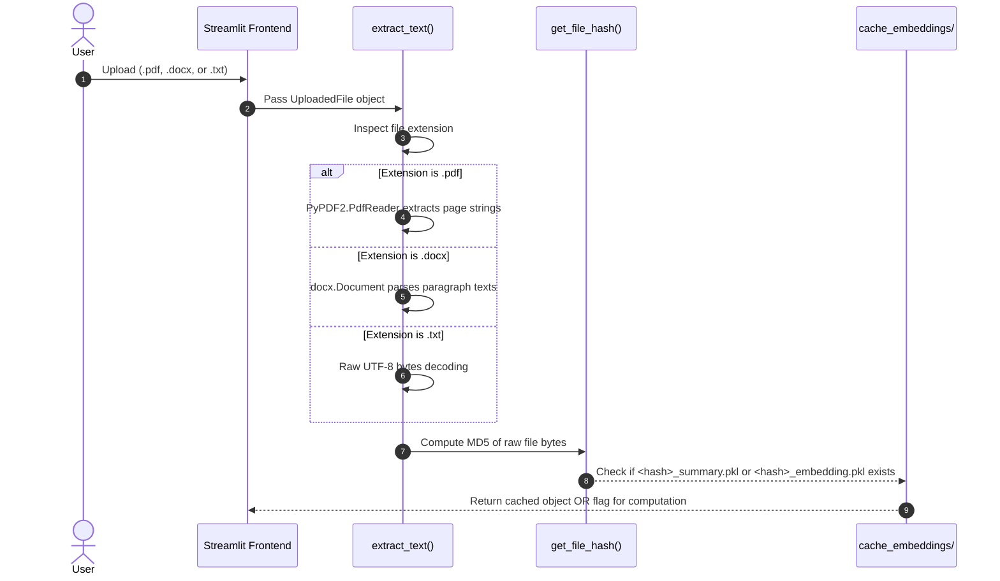
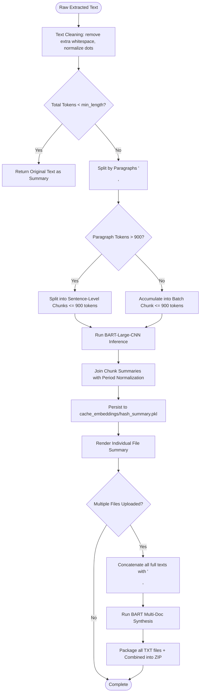
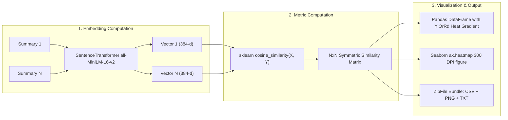
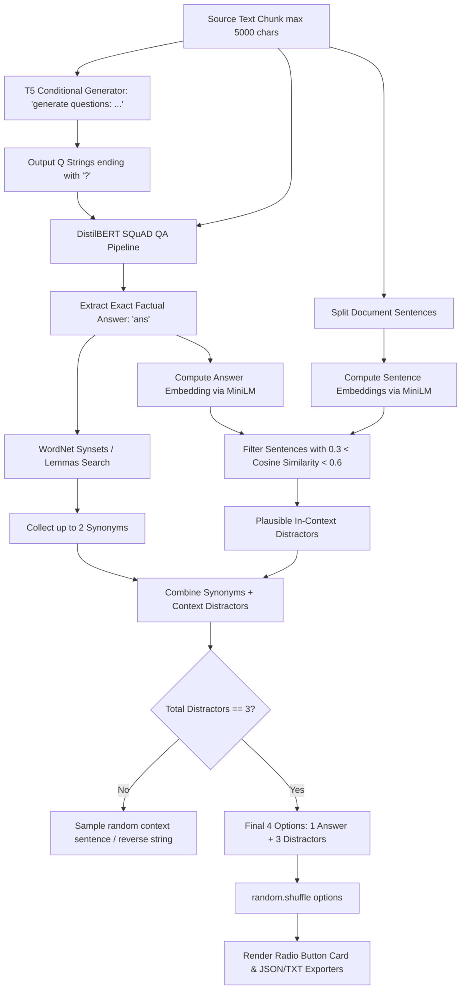
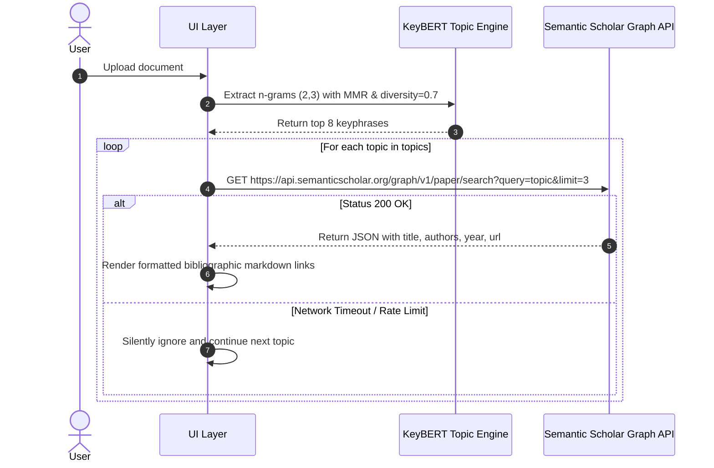

# 02. Architecture & Data Flow

---

## 1. High-Level System Architecture

ScholarSphere is architected around a layered, modular structure comprising four distinct operational planes:
1. **User Presentation & Interaction Layer (Streamlit UI)**
2. **Document Ingestion & Text Extraction Plane**
3. **Deep Learning & NLP Inference Engine**
4. **Caching, Persistence & External Service Layer**



---

## 2. Core Execution Lifecycles & Data Flows

### A. Document Ingestion & Text Preprocessing Flow

When a user selects files through the Streamlit upload widget, the data flow follows these steps:



---

### B. Summarization & Multi-Document Integration Flow

The summarization pipeline handles token length constraints and produces both granular and synthesized summaries:



---

### C. Similarity Calculation & Heatmap Generation Flow

The similarity analysis pipeline transforms text summaries into geometric points in high-dimensional vector space:



---

### D. Automated Quiz & Distractor Assembly Flow

The Quizzer engine coordinates question formulation, answer verification, and a 3-tier distractor pipeline:



---

### E. Research Explorer & Semantic Scholar Pipeline



---

## 3. Two-Tier Caching Architecture

ScholarSphere employs a multi-level caching hierarchy to guarantee responsiveness and eliminate redundant computation:

```
+-------------------------------------------------------------------------+
| Level 1: In-Memory Model Cache (Streamlit @st.cache_resource)           |
| Stores: BART Summarizer, Tokenizer, MiniLM, T5, QA Pipeline             |
| Scope: Shared across all sessions; loaded once per application start    |
+-------------------------------------------------------------------------+
                                    |
                                    v
+-------------------------------------------------------------------------+
| Level 2: Persistent Disk Cache (cache_embeddings/ directory)             |
| Stores: <md5_hash>_summary.pkl & <md5_hash>_embedding.pkl               |
| Key: MD5 Checksum of raw uploaded file bytes                            |
| Format: Python binary pickle serialization                              |
| Invalidation: Explicit manual trigger via sidebar "Clear All Cache"     |
+-------------------------------------------------------------------------+
```

### Disk Cache Eviction Algorithm
When the user clicks **"🔄 Clear All Cached Data"**:
1. `clear_cache()` reads `os.listdir("cache_embeddings")`.
2. Iterates over all files and executes `os.unlink(file_path)`.
3. Displays a confirmation toast (`st.success`).
4. Invokes `st.rerun()` to refresh the application state.

---

## 4. Hardware Allocation & Device Routing

ScholarSphere dynamically adapts to the host runtime environment:

```python
# Hardware Detection Logic in app_main.py
cuda_available = torch.cuda.is_available()
device_idx = 0 if use_gpu and cuda_available else -1
```

* **GPU Mode (`use_gpu=True` AND `cuda_available=True`):**
  - Hugging Face pipelines configure `device=0` (CUDA).
  - T5 PyTorch model calls `quiz_model.to("cuda")`.
  - Dramatically accelerates token generation and transformer matrix multiplications.
* **CPU Mode (`use_gpu=False` OR `cuda_available=False`):**
  - Hugging Face pipelines configure `device=-1` (CPU).
  - T5 PyTorch model calls `quiz_model.to("cpu")`.
  - Prevents CUDA out-of-memory errors on shared cloud instances (e.g., Hugging Face Spaces free tier).
