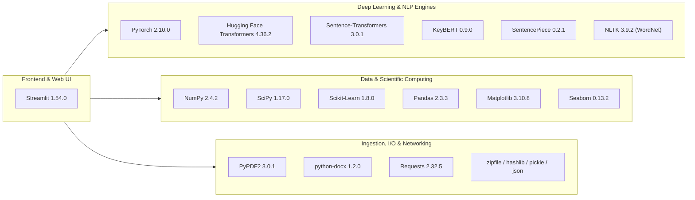

# 03. Technology Stack & Dependencies

---

## 1. Overview of Technology Stack

ScholarSphere is built with a focused, production-grade Python stack that combines a reactive front-end framework, modern Deep Learning NLP architectures, lexical databases, scientific computing libraries, and scholarly REST APIs.

---

## 2. Detailed Dependency Breakdown

### 2.1 Presentation & Web Application Layer

| Package | Version | Purpose & Architectural Role |
| :--- | :--- | :--- |
| **`streamlit`** | `1.54.0` | Core web framework. Delivers a reactive web interface, widget event loops, multi-tab layout (`st.tabs`), progress statuses (`st.status`), in-memory resource caching (`@st.cache_resource`), and dynamic downloads (`st.download_button`). |

---

### 2.2 Deep Learning, Transformers & NLP Frameworks

| Package | Version | Purpose & Architectural Role |
| :--- | :--- | :--- |
| **`torch`** | `2.10.0` | Core tensor computing and deep learning runtime. Provides CUDA backend integration for GPU acceleration and handles tensor operations for model inference. |
| **`transformers`** | `4.36.2` | Hugging Face's flagship library. Supplies pre-trained model architectures (`AutoTokenizer`, `T5ForConditionalGeneration`, `T5Tokenizer`), and high-level task pipelines (`summarization`, `question-answering`). |
| **`sentence-transformers`** | `3.0.1` | Specialized framework for state-of-the-art sentence, text, and paragraph dense vector embeddings. Powers `all-MiniLM-L6-v2`. |
| **`keybert`** | `0.9.0` | Minimal and easy-to-use keyword extraction technique that leverages BERT embeddings with Maximal Marginal Relevance (MMR) for candidate selection. |
| **`sentencepiece`** | `0.2.1` | Unsupervised text tokenizer and subword segmenter required by T5 tokenizers (`T5Tokenizer`). |
| **`safetensors`** | `0.7.0` | High-speed, secure tensor serialization format used by Hugging Face to load model weights without Python `pickle` vulnerabilities. |
| **`tokenizers`** | `0.15.2` | Fast Rust-backed tokenization engine providing rapid BPE (Byte-Pair Encoding) and WordPiece tokenization. |

---

### 2.3 Linguistic & Lexical Databases

| Package | Version | Purpose & Architectural Role |
| :--- | :--- | :--- |
| **`nltk`** | `3.9.2` | Natural Language Toolkit. Specifically utilizes the **WordNet** lexical database (`corpora/wordnet`) for synset queries, lemma extraction, and synonym harvesting to generate distractor options. |

---

### 2.4 Document Parsing & Ingestion

| Package | Version | Purpose & Architectural Role |
| :--- | :--- | :--- |
| **`PyPDF2`** | `3.0.1` | Pure-Python PDF extraction library. Iterates through document pages via `PdfReader` to extract raw textual strings. |
| **`python-docx`** | `1.2.0` | Microsoft Word (`.docx`) file parsing library. Extracts text from paragraphs, tables, and sections. |

---

### 2.5 Mathematics, Scientific Computing & Analytics

| Package | Version | Purpose & Architectural Role |
| :--- | :--- | :--- |
| **`scikit-learn`** | `1.8.0` | Machine learning toolkit. Powers `cosine_similarity(X, Y)` for vector distance matrix calculations. |
| **`numpy`** | `2.4.2` | Fundamental numerical mathematics package for multi-dimensional array operations, shape transformations, and vector manipulation. |
| **`scipy`** | `1.17.0` | Scientific computing algorithms, sparse matrix support, and statistical routines. |
| **`pandas`** | `2.3.3` | High-performance tabular data structures. Manages the document similarity matrix DataFrame, CSV serialization, and Streamlit HTML table styling. |

---

### 2.6 Data Visualization & Chart Rendering

| Package | Version | Purpose & Architectural Role |
| :--- | :--- | :--- |
| **`matplotlib`** | `3.10.8` | Core visualization engine. Manages `Figure` and `Axes` objects, label rotation, layout packing (`plt.tight_layout()`), and 300 DPI PNG buffer rendering. |
| **`seaborn`** | `0.13.2` | Statistical data visualization library built on Matplotlib. Generates color-mapped similarity heatmaps (`sns.heatmap`) with numerical annotations (`annot=True`, `cmap="YlOrRd"`). |

---

### 2.7 Networking, Serialization & Utilities

| Package | Version | Purpose & Architectural Role |
| :--- | :--- | :--- |
| **`requests`** | `2.32.5` | HTTP library used to submit REST queries to the **Semantic Scholar Graph API** (`https://api.semanticscholar.org/graph/v1/paper/search`). |
| **`hashlib`** *(StdLib)* | Built-in | Computes MD5 checksums of raw file byte streams to produce deterministic cache keys. |
| **`pickle`** *(StdLib)* | Built-in | Serializes generated summaries (strings) and embeddings (NumPy arrays) into disk storage (`cache_embeddings/*.pkl`). |
| **`zipfile`** *(StdLib)* | Built-in | Compresses multiple analysis reports, CSV matrices, PNG heatmaps, and summary text files into in-memory downloadable ZIP archives. |
| **`json`** *(StdLib)* | Built-in | Formats generated quiz questions into structured JSON data. |

---

## 3. Environment & Runtime Specifications

* **Language Specification:** Python `3.11.9` (declared in `runtime.txt`).
* **Platform Compatibility:** Windows 10/11 (PowerShell/CMD), Linux (Ubuntu 20.04/22.04 LTS), macOS (Darwin x86_64 / Apple Silicon ARM64).
* **Container / Cloud Deployment:** Designed for zero-configuration deployment on **Hugging Face Spaces** (Streamlit SDK) and Docker containers.
