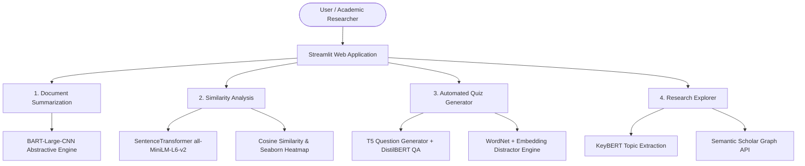

# 🎓 ScholarSphere — Documentation Hub

Welcome to the comprehensive documentation repository for **ScholarSphere** — an AI-powered academic writing, document analysis, and research exploration assistant.

This documentation suite provides an in-depth, rigorous breakdown of the entire system, ranging from high-level architecture and deep NLP model theory to function-by-function code references, algorithms, mathematical formulations, and operational deployment guides.

---

## 📚 Table of Contents

| Document | Focus Area | Description |
| :--- | :--- | :--- |
| **[01. Project Overview & Features](./01_project_overview_and_features.md)** | System Purpose & Capabilities | Core motivation, target audience, feature specifications for Summarization, Similarity Analysis, Quizzer, and Research Explorer. |
| **[02. Architecture & Data Flow](./02_architecture_and_data_flow.md)** | System Architecture | Component diagrams, execution lifecycles, two-tier caching strategy (MD5 disk cache + Streamlit memory cache), and hardware routing. |
| **[03. Technology Stack & Dependencies](./03_technology_stack_and_dependencies.md)** | Tech & Library Reference | Comprehensive catalog of frameworks, libraries, runtime environments, external APIs, and their structural roles in the app. |
| **[04. AI/NLP Models & Algorithms](./04_ai_nlp_models_and_algorithms.md)** | Machine Learning & Math | Deep dive into BART-large-CNN, all-MiniLM-L6-v2, T5 Question Generator, DistilBERT QA, KeyBERT MMR, WordNet distractor generation, and Cosine Similarity math. |
| **[05. Glossary & Keyword Definitions](./05_glossary_keywords_and_concepts.md)** | Terminological Encyclopedia | Alphabetized index defining over 50+ NLP, deep learning, software engineering, and mathematical concepts used in this project. |
| **[06. Installation, Deployment & Ops](./06_installation_deployment_and_operations.md)** | Setup & Operations Manual | Step-by-step local setup, GPU CUDA configuration, Hugging Face Spaces deployment structure, cache maintenance, and troubleshooting. |
| **[07. Codebase Walkthrough & API Reference](./07_codebase_walkthrough_and_api_reference.md)** | Source Code Documentation | Method-by-method, line-by-line explanation of `app.py`, `app_main.py`, helper utilities, state hooks, and UI pipelines. |

---

## 🌟 Executive Summary

**ScholarSphere** is designed to streamline academic workflows for students, educators, and researchers. By integrating state-of-the-art Transformer models from Hugging Face, sentence embedding architectures, lexical databases, and external academic APIs, ScholarSphere provides four essential workflows in a unified Streamlit interface:



---

## 🗂 Project Directory Structure

```text
ScholarSphere-main/
│
├── .streamlit/
│   └── config.toml                  # Streamlit runtime configuration
│
├── cache_embeddings/                # Disk-based MD5 hash pickle cache for summaries & embeddings
│
├── docs/                            # Comprehensive Project Documentation Suite
│   ├── README.md                    # Documentation Index (this file)
│   ├── 01_project_overview_and_features.md
│   ├── 02_architecture_and_data_flow.md
│   ├── 03_technology_stack_and_dependencies.md
│   ├── 04_ai_nlp_models_and_algorithms.md
│   ├── 05_glossary_keywords_and_concepts.md
│   ├── 06_installation_deployment_and_operations.md
│   └── 07_codebase_walkthrough_and_api_reference.md
│
├── testingFiles/                    # Sample documents (PDF, TXT) for testing & benchmarking
│   ├── All-Summer-in-a-Day-by-Ray-Bradbury.pdf
│   ├── ai_in_healthcare.txt
│   ├── climate_change.txt
│   ├── space_exploration.txt
│   └── ...
│
├── app.py                           # Deployment entry point (for Hugging Face Spaces)
├── app_main.py                      # Primary application logic, ML pipelines, and Streamlit UI
├── commands_explanation.txt         # Quick reference manual for developer commands
├── CONTRIBUTING.md                  # Contribution guidelines
├── README.md                        # High-level repository README
├── requirements.txt                 # Pinned Python package dependencies
└── runtime.txt                      # Python runtime version specification (Python 3.11.9)
```

---

## 🚀 Quick Navigation

To begin exploring the project details, start with **[01. Project Overview & Features](./01_project_overview_and_features.md)** or dive straight into **[02. Architecture & Data Flow](./02_architecture_and_data_flow.md)**.
